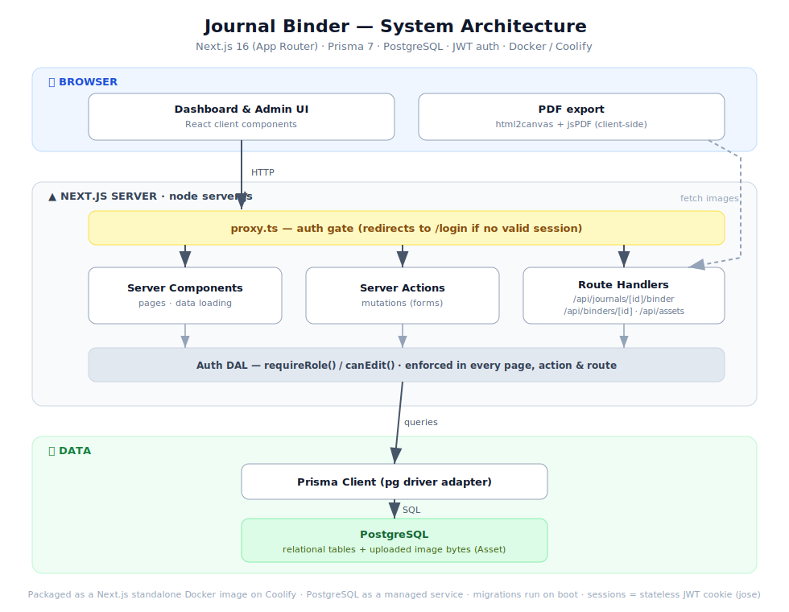
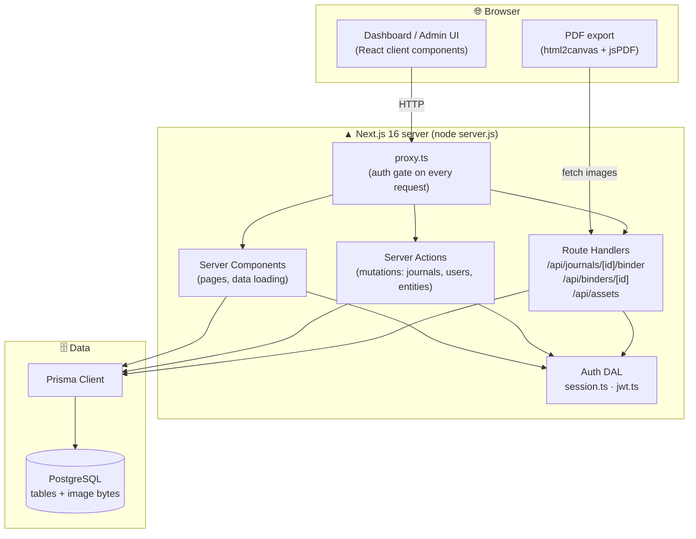
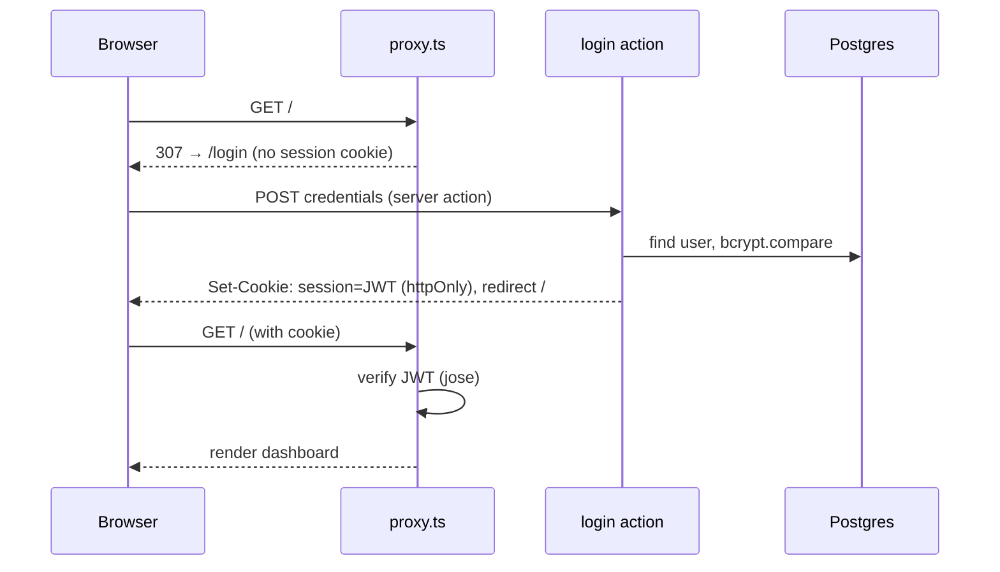
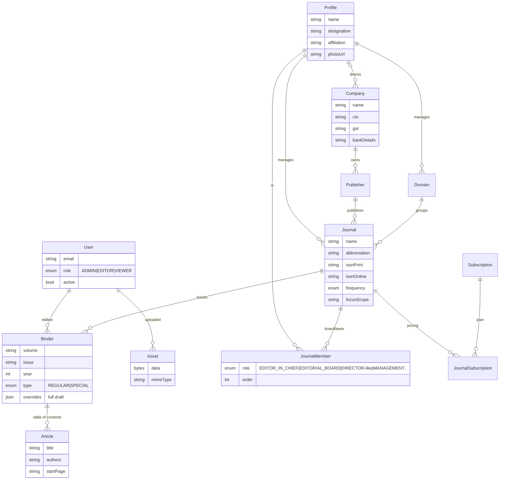
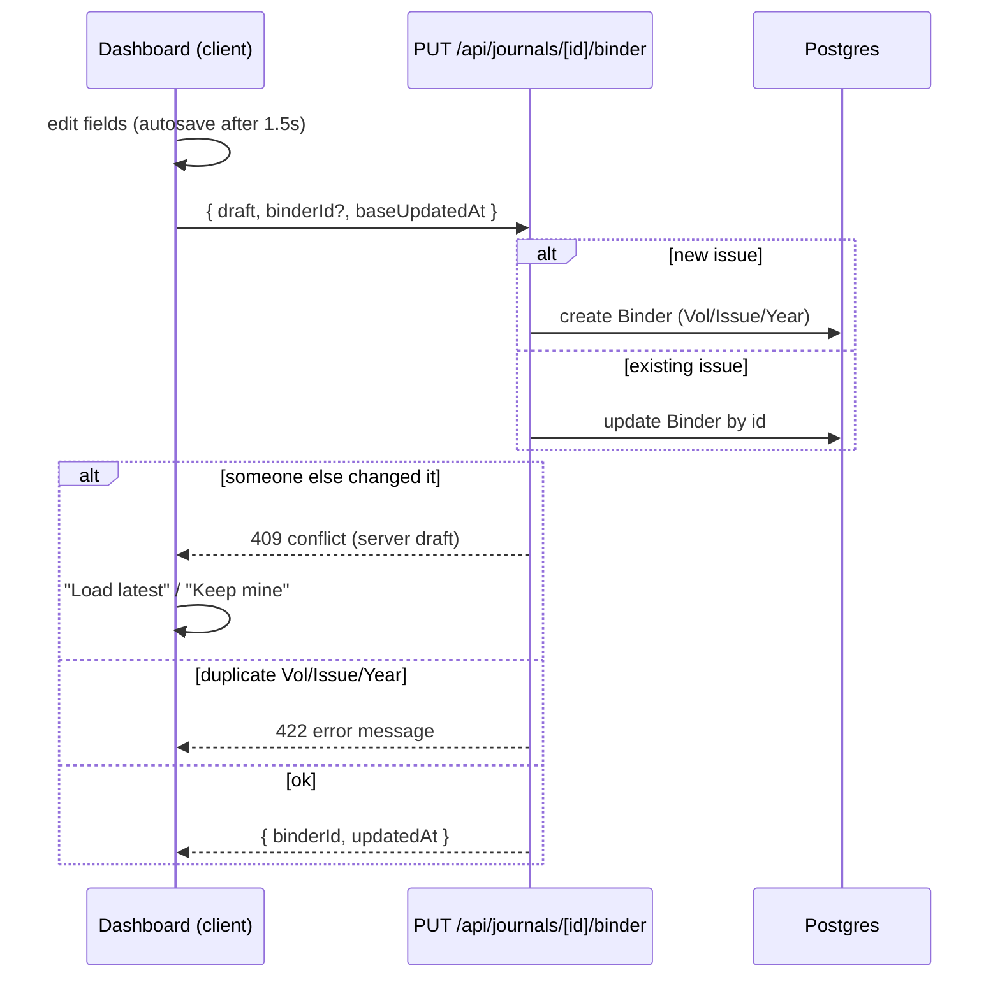

# Journal Binder — Architecture & Usage

A multi-user web app for building print-ready journal "binder" cover pages. It is a
Next.js 16 (App Router) application backed by PostgreSQL via Prisma, with
role-based authentication. Reference data (journals, people, companies) lives in
the database; users compose per-issue binders and export them to PDF.

---

## 1. Tech stack

| Layer | Choice |
|-------|--------|
| Framework | Next.js 16 (App Router, React 19, Turbopack) |
| Language | TypeScript |
| Database | PostgreSQL 17 |
| ORM | Prisma 7 (driver adapter `@prisma/adapter-pg`) |
| Auth | Custom stateless JWT sessions (`jose`) + bcrypt passwords |
| Styling | Tailwind CSS v4 |
| PDF export | html2canvas + jsPDF (client-side) |
| Deploy | Docker (standalone) on Coolify |

---

## 2. System architecture



<details><summary>Mermaid source (editable)</summary>



</details>

- **`proxy.ts`** (Next 16's renamed middleware) runs first and redirects
  unauthenticated requests to `/login`.
- **Server Components** load data directly through Prisma and render pages.
- **Server Actions** handle form mutations (create/update/delete journals, users,
  profiles, companies, etc.).
- **Route Handlers** back the interactive dashboard: saving binder drafts,
  listing/loading issues, and uploading/serving images.
- **Authorization** is enforced server-side in every page/action/route via
  `requireRole()` / `canEdit()` — the proxy is only an optimistic gate.

---

## 3. Authentication & request flow



- Sessions are **stateless signed JWTs** (HS256, 7-day expiry) stored in an
  httpOnly cookie. The token carries `userId`, `email`, `name`, `role`.
- Roles: **admin** (everything) ▸ **editor** (journals, binders, uploads) ▸
  **viewer** (read-only + export).

---

## 4. Data model



**Key ideas**
- **People are defined once** as `Profile` and reused everywhere (journal manager,
  company director, editorial board member) via the `JournalMember` join.
- **Company → Publisher → Journal** chain means company/legal details flow into
  every journal automatically.
- The editable document is the **Binder** (one per Volume/Issue/Year). It inherits
  journal defaults and stores per-issue content in `overrides` (JSON), with the
  table of contents mirrored into structured `Article` rows.
- **Images** are stored as bytes in the `Asset` table and served from
  `/api/assets/{id}`.

---

## 5. Binder draft persistence (the builder)



The **issue picker** in the sidebar lists all binders for a journal; you can
switch between issues, create a new one, or delete one.

---

## 6. Directory map

```
prisma/
  schema.prisma            data model
  migrations/              applied migrations
  seed.ts                  one-time seed from the CSVs
src/
  proxy.ts                 auth gate (Next 16 "middleware")
  lib/
    prisma.ts              Prisma client (pg adapter)
    auth/{jwt,session}.ts  JWT + role guards (DAL)
    journals.ts            DB → legacy Journal shape (dashboard)
    formidable.ts          DB → focus/editorial maps
    binder-store.ts        binder load/save/conflict logic
  app/
    page.tsx               the builder dashboard
    login/                 login page
    journals/              journal CRUD + board/pricing editors
    admin/                 profiles, companies, publishers, domains, subscriptions, users
    api/                   binder + asset route handlers
    actions/               server actions (mutations)
  components/              dashboard, forms, admin tables, header
journals_list.csv          seed source (catalog)
focus-and-scope_*.csv      seed source (focus/scope)
Dockerfile, docker-compose*.yml, COOLIFY.md
```

---

## 7. Run it locally

Prerequisites: Node 20+, Docker.

```bash
# 1. Start PostgreSQL (docker-compose, host port 55433)
npm run db:up

# 2. Install dependencies (also generates the Prisma client)
npm install

# 3. Apply migrations and seed from the CSVs (journals, people, admin user)
npm run db:migrate      # first run creates the schema
npm run db:seed

# 4. Start the dev server
npm run dev             # http://localhost:3000 (or next free port)
```

Sign in with the seeded admin from `.env`:
`ADMIN_EMAIL` / `ADMIN_PASSWORD` (default `admin@example.com` / `admin12345`).

Useful scripts: `npm run db:studio` (visual DB browser), `npm run db:reset`
(wipe + re-migrate + re-seed), `npm test`, `npm run build`.

### Production-style test
```bash
docker compose -f docker-compose.prod.yml up --build   # → http://localhost:3010
```

---

## 8. How to use the application

### A. Sign in
Go to `/login`. The header shows links based on your role:
**Journals** & **Setup** (editor+), **Users** (admin).

### B. Manage reference data — **Setup** (`/admin`)
Create these first so they're available in dropdowns:
1. **Profiles** — every person (editors, directors, board/management, managers).
2. **Companies** — legal entity, registered/sales address, CIN/GST, bank details,
   and the director (a Profile).
3. **Publishers** — each linked to a Company.
4. **Domains** — subject areas (+ logo + manager Profile).
5. **Subscriptions** — global plans with USD/INR prices.

Each has a list page with **New / Edit / Delete** (delete is admin-only). Images
can be typed as a URL or uploaded directly.

### C. Manage journals — **Journals** (`/journals`)
- **New / Edit** a journal: identity (name, abbreviation, ISSN, SJIF, ICV…),
  content (about, focus & scope, objectives), and relations (domain, publisher,
  manager) via dropdowns.
- On the edit page:
  - **Board & team** — attach Profiles with a role (Editor-in-Chief, Editorial
    Board, Director, Management…) and order. This fills the binder's people pages.
  - **Subscription pricing** — override global plan prices for this journal.

### D. Build a binder — the dashboard (`/`)
1. **Select a journal** (searchable combobox).
2. **Pick an issue** in the *Issue* dropdown, or choose **✳ New issue** to start a
   new Volume/Issue/Year. Use **Delete** to remove an issue.
3. Edit each page (cover, title, focus & scope, editorial board, director's desk,
   contents, etc.). Upload cover/logo/photo images inline.
4. Edits **autosave to the database** (look for "Auto-saved"). If someone else
   edited the same issue, you'll get a **conflict banner** — *Load latest* or
   *Keep mine*.
5. Switch to **Live Preview & Export** to download the cover or full binder as PDF.

> **Viewers** can browse and export but cannot edit or upload (the card shows
> "🔒 Read-only").

### E. Manage users — **Users** (`/admin/users`, admin only)
Create accounts, set roles (admin/editor/viewer), enable/disable, reset passwords.

---

## 9. Deploy

Push to `main`; Coolify builds the Dockerfile. You need a **PostgreSQL** resource
and these env vars: `DATABASE_URL`, `AUTH_SECRET`, `ADMIN_EMAIL`,
`ADMIN_PASSWORD`, and `RUN_SEED=true` **only for the first deploy**. Set the health
check path to **`/login`**. Migrations run automatically on every boot. Full
details in [COOLIFY.md](COOLIFY.md).
